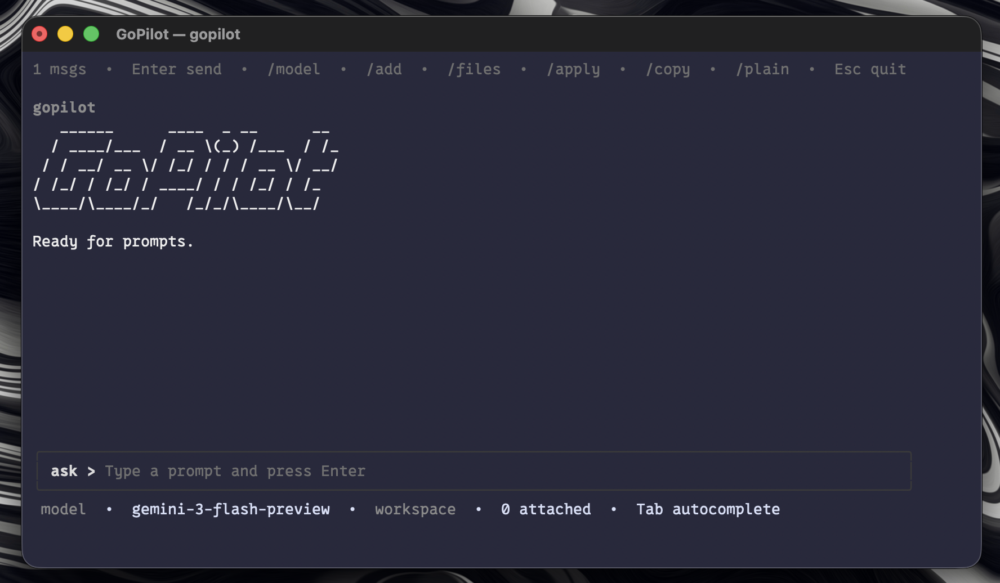

# GoPilot

A experimental terminal-based AI coding assistant built with Goland powered by Google Gemini.

```
   ______      ____  _ __      __
  / ____/___  / __ \(_) /___  / /_
 / / __/ __ \/ /_/ / / / __ \/ __/
/ /_/ / /_/ / ____/ / / /_/ / /_
\____/\____/_/   /_/_/\____/\__/
```

## Features

- **Stream responses** — Real-time streaming from Gemini models with live markdown rendering
- **File context** — Attach workspace files for code-aware conversations (respects `.gitignore`)
- **File editing** — AI proposes edits in `gopilot-file` blocks, apply with `/apply`, revert with `/undo`
- **Session persistence** — Automatic session save/load with structured and searchable history
- **Multiple models** — Switch between Gemini models on the fly
- **Smart autocomplete** — Tab-completion for commands, file paths, and model names
- **Rich code highlighting** — Chroma-powered syntax highlighting for code blocks, inline code, and markdown
- **Copy to clipboard** — Copy full responses or specific code blocks
- **Exponential backoff** — Automatic retry on rate limits (429) with jitter

## Screenshot
<p align="center">
  
</p>


## Prerequisites

GoPilot uses Google's Gemini API through OAuth credentials. You need:

1. **Google AI Pro membership** (or access to the Gemini API)
2. **OAuth credentials** from the [Gemini CLI](https://github.com/google-gemini/gemini-cli)

### Setting up credentials

Install and authenticate with the Gemini CLI first:

```bash
npx https://github.com/google-gemini/gemini-cli
```

This creates the OAuth credentials at `~/.gemini/oauth_creds.json` that GoPilot uses.

## Installation

### With Homebrew

```bash
brew install JakobAIOdev/tap/gopilot
```

Then run:

```bash
gopilot
```

### From source

```bash
git clone https://github.com/JakobAIOdev/GoPilot.git
cd GoPilot
make build
```

### With Go

```bash
go install github.com/JakobAIOdev/GoPilot/cmd/gopilot@latest
```

If your Go bin directory is not on your `PATH` yet:

```bash
export PATH="$(go env GOPATH)/bin:$PATH"
```

## Usage

Run from your project directory:

```bash
gopilot
```

GoPilot uses the current working directory as the workspace root. Attach files, ask questions, and let the AI suggest code changes.

### Quick Start

1. Start GoPilot in your project: `gopilot`
2. Attach relevant files: `/add main.go`
3. Or attach the whole codebase: `/codebase`
4. Ask your question: `What does this code do?`
5. If the AI suggests edits: `/apply` to accept, `/undo` to revert

## Commands

| Command | Description |
|---------|-------------|
| `/add <file>` | Attach a file or directory as context |
| `/apply` | Apply proposed file edits from the last response |
| `/clear` | Reset conversation (keeps attached files) |
| `/codebase` | Attach entire working directory |
| `/copy` | Copy last response to clipboard |
| `/copy code` | Copy all code blocks from last response |
| `/copy code N` | Copy the Nth code block |
| `/delete <id>` | Delete a saved session |
| `/delete all` | Delete all saved sessions |
| `/drop <file>` | Remove an attached file |
| `/files` | List attached files |
| `/help` | Show available commands and shortcuts |
| `/load` | Open session browser |
| `/load <id>` | Load a specific session |
| `/model` | Open model selector |
| `/model <name>` | Switch to a specific model |
| `/new` | Start a new session |
| `/plain` | Show last response as plain text |
| `/sessions` | List saved sessions |
| `/undo` | Revert last applied edits |
| `/undo session` | Revert all edits from this session |

## Keyboard Shortcuts

| Shortcut | Action |
|----------|--------|
| `Enter` | Send prompt |
| `Tab` | Autocomplete commands, paths, models |
| `Ctrl+N` / `Ctrl+P` | Cycle models forward / backward |
| `Up` / `Down` | Navigate completions or scroll |
| `Esc` | Quit (or exit current menu) |

## Supported Models

| Model | Description |
|-------|-------------|
| `gemini-3-flash-preview` | Latest flash model (default) |
| `gemini-3.1-pro-preview` | Latest pro model |
| `gemini-2.5-flash` | Stable flash model |
| `gemini-2.5-flash-lite` | Lightweight flash model |
| `gemini-2.5-pro` | Stable pro model |

## Configuration

GoPilot uses environment variables for optional configuration:

| Variable | Default | Description |
|----------|---------|-------------|
| `GEMINI_API_BASE_URL` | `https://cloudcode-pa.googleapis.com/v1internal` | API endpoint |

Sessions are stored in `~/.config/gopilot/sessions/` (macOS/Linux).

## Project Structure

```
GoPilot/
├── cmd/gopilot/          # Entry point
├── internal/
│   ├── app/              # TUI application (Bubble Tea)
│   │   ├── model.go      # Main state & slash commands
│   │   ├── update.go     # Event loop & stream handling
│   │   ├── render.go     # Markdown rendering & layout
│   │   ├── styles.go     # Lipgloss styles
│   │   ├── helpers.go    # File editing, autocomplete, context
│   │   ├── sessions.go   # Session persistence
│   │   └── models.go     # Available model list
│   ├── chat/             # Shared types (Message, Request, Backend)
│   └── gemini/           # Gemini API client & auth
│       ├── backend.go    # Stream, context, retry logic
│       └── auth.go       # OAuth token management
├── Makefile
└── go.mod
```

## Built With

- [Bubble Tea](https://github.com/charmbracelet/bubbletea) — Terminal UI framework
- [Bubbles](https://github.com/charmbracelet/bubbles) — TUI components
- [Lip Gloss](https://github.com/charmbracelet/lipgloss) — Style definitions
- [Chroma](https://github.com/alecthomas/chroma) — Syntax highlighting

## Contributing

1. Fork the repository
2. Create a feature branch (`git checkout -b feature/my-feature`)
3. Commit your changes (`git commit -am 'Add my feature'`)
4. Push to the branch (`git push origin feature/my-feature`)
5. Open a Pull Request

## License

This project is open source. See the repository for license details.

## Acknowledgments

Inspired by:
- [gmn](https://github.com/tomohiro-owada/gmn) — Terminal Gemini client
- [gemini-cli](https://github.com/google-gemini/gemini-cli) — Official Gemini CLI
